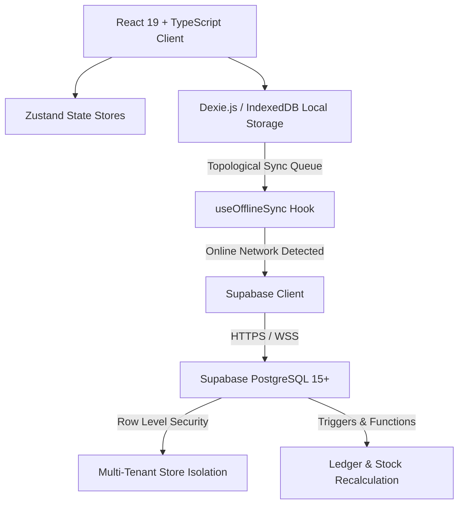

# 🏪 মুদিদোকান (MudiDokan 2.00) / Amar Dokan (আমার দোকান)
### *Hyper-Localized Offline-First Retail OS, Multi-Store SaaS & Digital Bakir Khata for Bangladeshi Retailers*

[](https://react.dev/)
[](https://www.typescriptlang.org/)
[](https://vitejs.dev/)
[](https://tailwindcss.com/)
[](https://supabase.com/)
[](https://dexie.org/)
[](https://opensource.org/licenses/MIT)

---

## 📖 Overview / পরিচিতি

**মুদিদোকান (MudiDokan 2.00 / Amar Dokan)** is a hyper-localized retail operating system, modern Point of Sale (POS), and digital credit ledger (*Bakir Khata*) engineered specifically for grocery store shopkeepers (*mudi dokandars*), super shops, and retailers across Bangladesh.

Designed with **zero cognitive load**, **unstable mobile network resiliency (2G/3G/4G network drops)**, **fast multi-modal checkout**, **multi-store SaaS management**, and **bulletproof financial consistency**.

---

## 🌟 Key Features & Modules

### 1. 🛒 Frictionless Quick-POS (পয়েন্ট অফ সেল)
* **1-Tap Unbarcoded Bulk Grid:** High-frequency goods (খোলা সয়াবিন তেল, চিনি, মসুর ডাল, ফার্মের ডিম, গোল আলু, পেঁয়াজ, মিনিকেট চাল, রসুন ইত্যাদি) with localized visual cards and 1-tap cart additions.
* **Bulk Unit & Weight Converter:** Instant quantity presets (২৫০ গ্রাম, ৫০০ গ্রাম, ১ কেজি, ২ কেজি, ৫ কেজি, ডজন, হালি) with automatic BDT price calculation.
* **Hardware Barcode Scanner Support:** Automated low-latency stream listener detects high-speed hardware barcode scanner keystrokes ($\le 50\text{ms}$) terminating with Enter.
* **Bilingual Phonetic Search:** Search products typing Bengali script (`চিনি`, `তেল`), English (`sugar`), or English phonetics (`chini`, `tel`, `dal`, `alu`) and barcode scanning in `src/lib/phoneticSearch.ts`.
* **Split & Multi-Modal Payments:**
  * 💵 **ক্যাশ বিক্রি (Full Cash)** with exact change calculation.
  * 🔴 **বাকিতে বিক্রি (Full Due to Customer)** directly updating customer ledger.
  * 💳 **আংশিক ও ডিজিটাল পেমেন্ট (Split Payment):** Cash + bKash / Nagad / Rocket + Due.

---

### 2. 🧾 Native 58mm & 80mm ESC/POS Thermal Receipts
* Pure CSS printable thermal receipts formatted precisely for standard **58mm** and **80mm** roll widths.
* Displays store branding, Bengali invoice numbers, itemized quantities, customer previous balance, and total cumulative dues.
* **1-Click WhatsApp & SMS Reminders:** Instant link generators with pre-filled Bengali messages containing pending balance and store bKash/Nagad merchant numbers.

---

### 3. 📖 Digital Bakir Khata (ডিজিটাল বাকির খাতা)
* **11-Digit Bangladeshi Mobile Validation:** Validates local phone numbers (`^01[3-9]\d{8}$`).
* **High-Contrast Semantic Balances:**
  * 🔴 **Crimson Red:** Customer owes money to shopkeeper (বকেয়া দেনা).
  * 🟢 **Emerald Green:** Cleared / zero balance (হিসাব পরিশোধিত).
* **বাকি আদায় (Collect Due) Modal:** Fast repayment recording with instant trigger rebalancing.
* **Audit-Trail Ledger:** Immutable chronological transaction history per customer with detailed date stamps.

---

### 4. 📦 Stock Management & Daily Profit Engine
* **Visual Stock Status Monitors:**
  * 🟢 **পর্যাপ্ত (In Stock)**
  * 🟡 **কম স্টক (Low Stock $\le$ alert threshold)**
  * 🔴 **স্টক শেষ (Out of Stock / 0 units)**
* **Daily Hisab-Kitab Analytics:**
  * **মোট বিক্রি (Total Sales Revenue)**
  * **ক্যাশবাক্সে নগদ জমা (Cash Collected in Drawer)**
  * **নতুন বাকি (New Credit Extended)**
  * **বাকি আদায় (Past Due Recovered)**
  * **দৈনিক দোকান খরচ (Operating Expenses):** Rent, Electricity, Tea, Staff Meal, Transport.
  * **নিট লাভ (Estimated Net Profit):** $\text{Revenue} - (\text{COGS} + \text{Expenses})$.
* **Transaction Detail Breakdown:** Deep-dive modal inspecting itemized sale breakdown, profit per transaction, and payment distribution.

---

### 5. ⚡ Offline-First Architecture & FIFO Mutation Sync
* Runs **100% offline out-of-the-box** using Dexie.js (IndexedDB) and installs as a **PWA** — service worker precaches the app shell for zero-network launches.
* Automatically intercepts checkout mutations and credit transactions in an offline queue (`sync_queue`).
* Background FIFO listener automatically syncs mutations to Supabase PostgreSQL when internet connectivity returns, in foreign-key order with exponential backoff.
* **One queue row = one table row:** Server-side triggers manage derived values (stock depletion, ledger rebalancing).
* Interactive **"অফলাইন টেস্ট"** switch to test connectivity drops on demand.

---

### 6. 👥 Multi-Role Staff & Multi-Store SaaS Governance
* **Hierarchical Role-Based Access Control (RBAC):**
  * 👑 **Super Admin:** Multi-store network oversight, store approval workflows, and store inspection mode.
  * 🏢 **Owner (দোকান মালিক):** Store settings, financial reports, profit/loss analysis, staff administration, and inventory management.
  * 👔 **Manager (ম্যানেজার):** Daily stock adjustments, receipts, and order management.
  * 🛒 **Cashier (ক্যাশিয়ার):** Streamlined POS billing, customer searches, and receipt generation.

---

## 🏗️ System Architecture & Technology Stack



| Layer | Technologies |
| :--- | :--- |
| **Client Core** | React 19 + TypeScript + Vite 8 |
| **Styling** | Tailwind CSS v3 + Hind Siliguri (Bengali Typography) |
| **Icons** | Lucide React |
| **State Management** | Zustand 5 (POS Cart, Auth, and UI states) |
| **Local Database** | Dexie.js 4 (IndexedDB offline database & sync queue) |
| **Backend & Cloud** | Supabase Edge + PostgreSQL 15+ (Multi-Tenant RLS & Triggers) |
| **Receipt Output** | Web Print API (58mm / 80mm ESC/POS) + WhatsApp URL Scheme |
| **Deployment** | Vercel SPA Routing (`vercel.json`) |

---

## 🚀 Quick Start

### 1. Install Dependencies
```bash
npm install
```

### 2. Start Development Server
```bash
npm run dev
```
Open [http://localhost:5173/](http://localhost:5173/) in your browser.

### 3. Production Build
```bash
npm run build
```

---

## 🗄️ Supabase PostgreSQL Setup (Optional for Cloud Sync)

To connect with a live Supabase instance:
1. Copy `.env.example` to `.env`:
   ```bash
   cp .env.example .env
   ```
2. Set your Supabase project credentials:
   ```env
   VITE_SUPABASE_URL=https://your-project.supabase.co
   VITE_SUPABASE_ANON_KEY=your-anon-key-here
   ```
3. Run the SQL schema and seed migrations in the Supabase SQL Editor:
   - [`supabase/migrations/20260830000001_core_schema.sql`](supabase/migrations/20260830000001_core_schema.sql)
   - [`supabase/seed.sql`](supabase/seed.sql)

---

## 🔒 Security & Access

- **Cashier PIN Protection:** Tap the lock icon in the header to lock the register. Unlocking needs the staff member's 4-digit PIN.
- **Secure Password Hashing:** Passwords and PINs are hashed using salted SHA-256 digests (`src/lib/secureHash.ts`).
- **Tenant Isolation:** Every local query is scoped by `store_id`, and in Supabase, Row-Level Security restricts each store to its own rows. `is_super_admin()` provides global governance.

### Demo Credentials (Development Builds)

| Role | Phone | Password |
| :--- | :--- | :--- |
| 👑 সুপার অ্যাডমিন (Super Admin) | `01700000000` | `admin123` |
| 🏢 দোকান মালিক (Store Owner) | `01711998877` | `dokan123` |
| 👔 ম্যানেজার (Manager) | `01811223344` | `dokan123` |
| 🛒 ক্যাশিয়ার (Cashier) | `01911334455` | `dokan123` |

---

## 🧭 Business Rules & Localized Logic

- **Asia/Dhaka Business Day:** The financial day is aligned with Asia/Dhaka time (`src/lib/dateUtils.ts`).
- **Real-world Physical Stock Handling:** Dokandars are not hard-blocked from selling goods physically in front of them; negative shortfall triggers real-time visual alerts.
- **Unit Conversions:** All stock operations convert through standardized base units (`src/lib/units.ts`).
- **Cash Drawer Reconciliations:** Cash counts and day closings persist daily opening floats.

---

## 🌐 Deployment

### Deploying to Vercel
This repository includes a [`vercel.json`](vercel.json) pre-configured for Single Page Application (SPA) routing.

1. Push the repository to GitHub.
2. Import the project into [Vercel](https://vercel.com/).
3. Add `VITE_SUPABASE_URL` and `VITE_SUPABASE_ANON_KEY` to your environment variables.
4. Deploy!

---

## 📄 License

Distributed under the **MIT License**.

<div align="center">
  <sub>Built with ❤️ for retail shopkeepers across Bangladesh 🇧🇩</sub>
</div>
